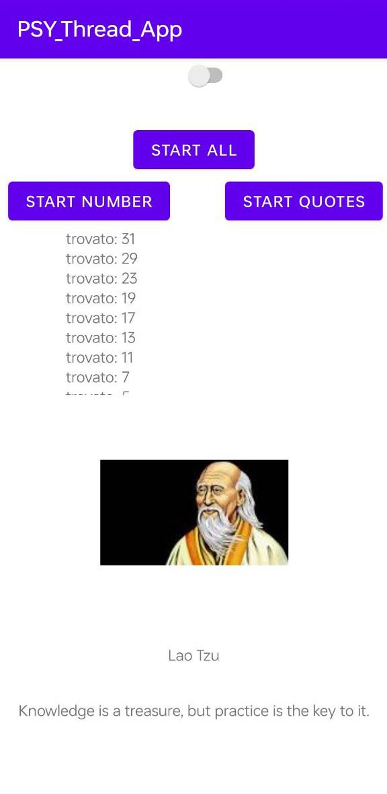

# Progetto Multithread Android - PSY

## Descrizione:

L'applicazione permette di gestire due thread concorrenti (tre contando anche il main). Il primo thread interroga l'API di ZenQuotes per ottenere una citazione casuale. Appena ricevuta la risposta, il thread esegue anche una ricerca di immagini su Google per trovare una foto associata all'autore. Il secondo thread calcola tutti i numeri primi (fino a un limite di 100) e li aggiunge a una lista. La lista viene visualizzata e continuamente aggiornata con i nuovi numeri primi calcolati. Inoltre, uno switch permette di cambiare lo sfondo dell'applicazione in qualsiasi momento.

## Interazione con l'utente:

L'interfaccia utente è composta da tre bottoni:

- Avvia tutto: avvia i due thread
- Avvia numeri: avvia il thread che calcola i numeri primi
- Avvia citazioni: avvia il thread per la ricerca delle citazioni

Il toggle in cima all'interfaccia utente permette di cambiare lo sfondo dell'interfaccia utente in modo fluido e immediato.

## Struttura dell'applicazione:

L'applicazione è composta dalle seguenti classi:

- MainActivity: classe principale dell'applicazione. Gestisce l'interazione con l'utente e i thread.
- QuotesRunnable: classe che implementa il thread per l'interrogazione dell'API di ZenQuotes.
- NumbersRunnable: una classe che implementa il thread per il calcolo dei numeri primi. Vengono presi in considerazione solo i numeri primi minori di 100 (hardcoded). Ogni volta che viene trovato un numero primo, viene aggiunto alla lista e viene eseguito un timeout di 1 secondo.

Per l'implementazione dei thread è stata utilizzata l'interfaccia Runnable, mentre per aggiornare l'interfaccia grafica da un thread esterno alla MainActivity viene utilizzato il metodo runOnUiThread.

## Note:

- Interfaccia Grafica:
In questa esercitazione non è stata prestata particolare attenzione all'interfaccia grafica, al fit del testo all'interno delle label e alla compatibilità su più dispositivi.
- Gestione Errori:
L'applicazione presenta una gestione delle eccezioni marginale. In particolare, si assume sempre il caso migliore in cui l'utente ha disponibilità di connessione ad internet, l'API di ZenQuotes è disponibile e la ricerca di immagini su Google ha successo. In caso di errori, l'applicazione potrebbe non funzionare correttamente.
- Considerazioni generali:
L'implementazione delle classi è stata fatta per comodità all'interno dello stesso file MainActivity.java, limitando così il passaggio di parametri a discapito della pulizia del codice.